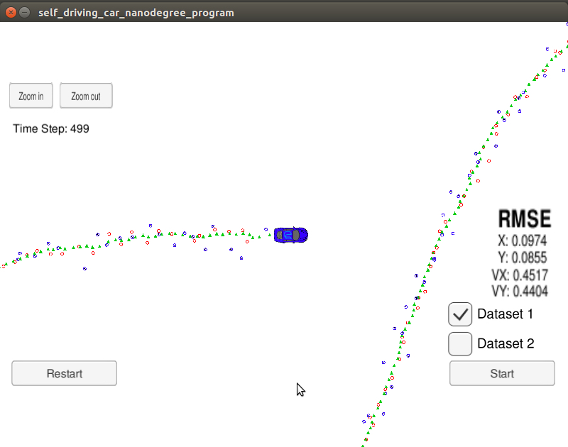
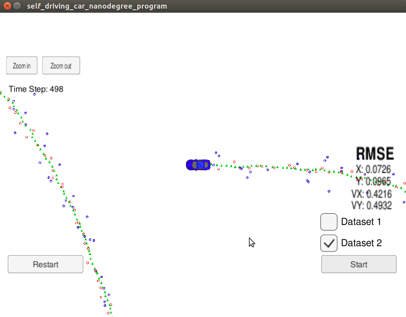

# Project Extended Kalman Filter
Udacity Self-Driving Car Nanodegree - Extended Kalman Filter Implementation

In this project an extended kalman filter is implemented in C++ to estimate the state of a moving object of interest with noisy lidar and radar measurements.

This project involves the Term 2 Simulator which can be downloaded [here](https://github.com/udacity/self-driving-car-sim/releases)

This repository includes two files that can be used to set up and install [uWebSocketIO](https://github.com/uWebSockets/uWebSockets) for either Linux or Mac systems. For windows you can use either Docker, VMware, or even [Windows 10 Bash on Ubuntu](https://www.howtogeek.com/249966/how-to-install-and-use-the-linux-bash-shell-on-windows-10/) to install uWebSocketIO. Please see [this concept in the classroom](https://classroom.udacity.com/nanodegrees/nd013/parts/40f38239-66b6-46ec-ae68-03afd8a601c8/modules/0949fca6-b379-42af-a919-ee50aa304e6a/lessons/f758c44c-5e40-4e01-93b5-1a82aa4e044f/concepts/16cf4a78-4fc7-49e1-8621-3450ca938b77) for the required version and installation scripts.

# Prerequisites

The project has the following dependencies (from Udacity's seed project):

- cmake >= 3.5
- make >= 4.1
- gcc/g++ >= 5.4
- Udacity's simulator.

For instructions on how to install these components on different operating systems, please, visit [Udacity's seed project](https://github.com/udacity/CarND-Extended-Kalman-Filter-Project). The implementation was done on Mac OS and Linux Ubuntu 16.04.

In order to install the necessary libraries, use the [install-mac.sh](./install-mac.sh) or [install-ubunut.sh](./install-ubuntu.sh)

# Compiling and executing the project

These are the suggested steps:

- Clone the repo and cd to it on a Terminal.
- Create the build directory: `mkdir build`
- `cd build`
- `cmake ..`
- `make`: This will create an executable in the build directory
- `./ExtendedKF` :  Execute EKF implementation.

The CMakeLists.txt is also in the src folder for using in [Eclipse IDE](ide_profiles/Eclipse/README.md).

The simulator provides two datasets. The difference between them are:

- The direction the car (the object) is moving.
- The order the first measurement is sent to the EKF. On dataset 1, the LIDAR measurement is sent first. On the dataset 2, the RADAR measurement is sent first.

Here is the simulator final state after running the EKL with dataset 1:

Here is the simulator final state after running the EKL with dataset 2:

# [Rubric](https://review.udacity.com/#!/rubrics/748/view) points

## Compiling

### Your code should compile

The code compiles without errors.

## Accuracy

### px, py, vx, vy output coordinates must have an RMSE <= [.11, .11, 0.52, 0.52] when using the file: "obj_pose-laser-radar-synthetic-input.txt which is the same data file the simulator uses for Dataset 1"

The EKF accuracy was:

- Dataset 1 : RMSE <= [0.0974, 0.0855, 0.4517, 0.4404]
- Dataset 2 : RMSE <= [0.0726, 0.0965, 0.4216, 0.4932]

## Following the Correct Algorithm

### Your Sensor Fusion algorithm follows the general processing flow as taught in the preceding lessons.

The Kalman filter implementation can be found [src/kalman_filter.cpp](./src/kalman_filter.cpp) and it is used to predict at [src/FusionEKF.cpp](./src/FusionEKF.cpp#L110) line 110 and to update line 146.

### Your Kalman Filter algorithm handles the first measurements appropriately.

The first measurement is handled at [src/FusionEKF.cpp](./src/FusionEKF.cpp#L57) from line 57 to line 108.

### Your Kalman Filter algorithm first predicts then updates.
The predict operation could be found at [src/FusionEKF.cpp](./src/FusionEKD.cpp#L147) line 110 and the update operation from line 146 of the same file.

### Your Kalman Filter can handle radar and lidar measurements.

Different type of measurements are handled in two places in [src/FusionEKF.cpp](./src/FusionEFK.cpp):

- For the first measurement from line 67 to line 99.
- For the update part from line 155 to 165.

## Code Efficiency

### Your algorithm should avoid unnecessary calculations.

An example of this calculation optimization is when the Q matrix is calculated [src/FusionEKF.cpp](./src/FusionEKF.cpp#L141) line 131 to line 138.

